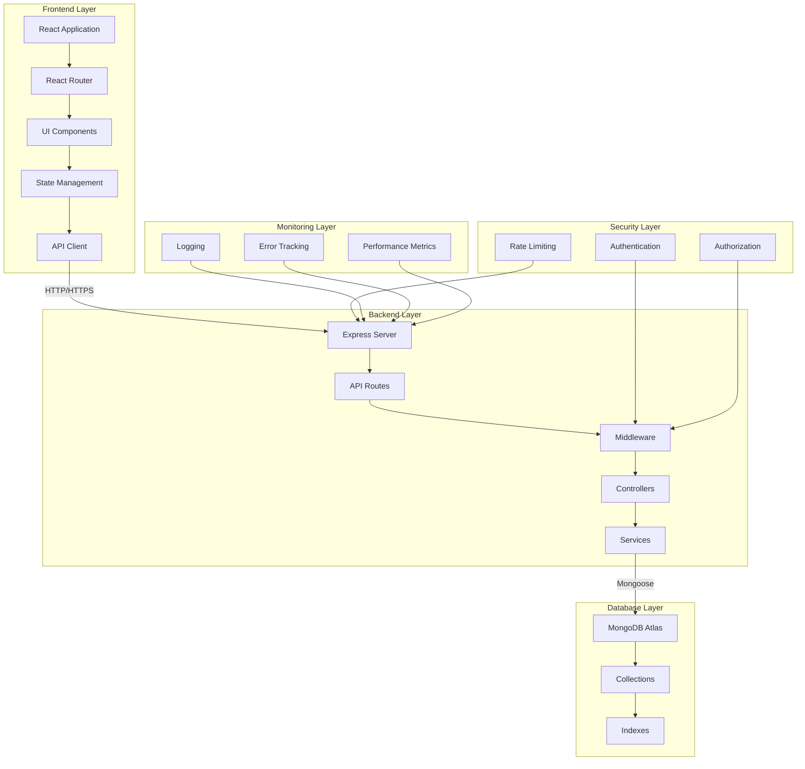

# System Architecture

## Overview
The Car Rental application follows a modern three-tier architecture pattern, consisting of:
1. Presentation Layer (Frontend)
2. Application Layer (Backend)
3. Data Layer (Database)

## Architecture Diagram



## Component Details

### Frontend Layer
- **React Application**: Single Page Application (SPA)
- **React Router**: Client-side routing
- **UI Components**: Reusable components with Tailwind CSS
- **State Management**: React Hooks for local state
- **API Client**: Axios for HTTP requests

### Backend Layer
- **Express Server**: Node.js web framework
- **API Routes**: RESTful endpoints
- **Middleware**:
  - Authentication
  - Validation
  - Error Handling
  - Logging
- **Controllers**: Business logic handlers
- **Services**: Business logic and data processing

### Database Layer
- **MongoDB Atlas**: Cloud-hosted NoSQL database
- **Collections**:
  - Rentals
  - Cars
  - Users (future)
- **Indexes**: Optimized for query performance

### Security Layer
- **Authentication**: User identity verification
- **Authorization**: Access control
- **Rate Limiting**: API request throttling

### Monitoring Layer
- **Logging**: Application activity tracking
- **Error Tracking**: Exception monitoring
- **Performance Metrics**: System performance monitoring

## Data Flow

1. **User Request Flow**:
   ```
   User -> Frontend -> API Client -> Backend -> Database
   ```

2. **Response Flow**:
   ```
   Database -> Backend -> API Client -> Frontend -> User
   ```

3. **Security Flow**:
   ```
   Request -> Authentication -> Authorization -> Rate Limiting -> Processing
   ```

4. **Monitoring Flow**:
   ```
   Application Activity -> Logging -> Error Tracking -> Performance Metrics
   ```

## Security Measures

1. **Frontend**:
   - Input validation
   - XSS prevention
   - CSRF protection
   - Secure HTTP headers

2. **Backend**:
   - Request validation
   - Rate limiting
   - Error handling
   - Secure headers
   - JWT authentication

3. **Database**:
   - Data encryption
   - Access control
   - Backup strategy
   - Connection security

## Performance Considerations

1. **Frontend**:
   - Code splitting
   - Lazy loading
   - Image optimization
   - Caching
   - Bundle optimization

2. **Backend**:
   - Connection pooling
   - Query optimization
   - Response compression
   - Caching
   - Load balancing

3. **Database**:
   - Indexing strategy
   - Query optimization
   - Connection management
   - Data partitioning

## Scalability

1. **Horizontal Scaling**:
   - Load balancing
   - Multiple instances
   - Database sharding
   - Microservices architecture

2. **Vertical Scaling**:
   - Resource optimization
   - Memory management
   - CPU utilization
   - Cache optimization

## Monitoring and Logging

1. **Application Monitoring**:
   - Performance metrics
   - Error tracking
   - User analytics
   - Resource utilization

2. **Logging**:
   - Request logs
   - Error logs
   - Audit logs
   - Security logs

## Future Improvements

1. **Features**:
   - User authentication
   - Payment integration
   - Admin dashboard
   - Real-time updates
   - Mobile application

2. **Technical**:
   - Microservices architecture
   - GraphQL API
   - WebSocket integration
   - Containerization
   - CI/CD pipeline 